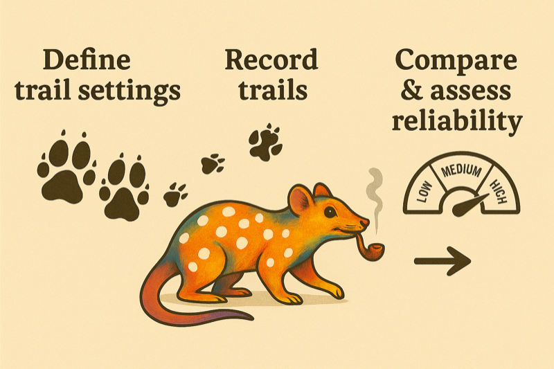

<!-- README.md is generated from README.Rmd. Please edit that file -->

```{r, include = FALSE}
knitr::opts_chunk$set(
  collapse = TRUE,
  comment = "#>",
  fig.path = "man/figures/README-",
  out.width = "100%"
)
```

# quallmer <a href="https://SeraphineM.github.io/quallmer/"></a>

<!-- badges: start -->
[](https://lifecycle.r-lib.org/articles/stages.html#experimental)
[](https://CRAN.R-project.org/package=quallmer)
[](https://github.com/SeraphineM/quallmer/actions/workflows/R-CMD-check.yaml)
[](https://app.codecov.io/gh/SeraphineM/quallmer)
[](https://SeraphineM.github.io/quallmer/)
<!-- badges: end -->

The `quallmer` package is an **easy-to-use toolbox for qualitative researchers to quickly apply AI-assisted annotation to texts, images, pdfs, tabular data and other structured data.** 

Using `annotate()`, users can generate structured, interpretable outputs powered by large language models (LLMs). The package includes a library of [predefined tasks for common qualitative coding needs](https://seraphinem.github.io/quallmer/articles/pkgdown/examples/overview.html), such as sentiment analysis, thematic coding, and stance detection. It also allows users to [create their own custom annotation tasks tailored to their specific research questions and data types](https://seraphinem.github.io/quallmer/articles/pkgdown/tutorials/customtask.html) using `task()`. To ensure quality and reliability of AI-generated annotations, `quallmer` offers tools for comparing LLM outputs with human-coded data and assessing inter-coder reliability. With `agreement()`, users can launch an interactive app to manually code data, review AI annotations, and evaluate intercoder reliability between coders and agreement with LLM-generated scores.

**The `quallmer` package makes AI-assisted qualitative coding accessible without requiring deep expertise in R, programming or machine learning.**

# Core functions

The package provides the following core functions:

### `annotate()`
- A generic function that works with any LLM supported by [ellmer](https://ellmer.tidyverse.org/index.html).  
- Generates structured responses based on [predefined](https://seraphinem.github.io/quallmer/articles/pkgdown/examples/overview.htmll) or [user-defined tasks](https://seraphinem.github.io/quallmer/articles/pkgdown/tutorials/customtask.html).  

### `task()`
- Creates custom annotation tasks tailored to specific research questions and data types.
- Uses `system_prompt` and various type specifications from the [ellmer](https://ellmer.tidyverse.org/reference/type_boolean.html) package to define how the LLM should interpret inputs and format outputs.  
- Tasks created with `task()` can be passed directly to `annotate()`.  
- This allows users to tailor the annotation process to their specific data types and makes our package extensible for future use cases.

### `agreement_app()`
- Launches an interactive app to 
    - Manually code data
    - Review and validate LLM-generated annotations
    - Compare human-coded data with LLM-generated annotations to evaluate agreement and inter-coder reliability with various metrics (e.g., Krippendorff's alpha, Cohen's or Fleiss' kappa).

### `agreement()`
- Calculates intercoder reliability scores (e.g., Krippendorff's alpha and Cohen's or Fleiss' kappa) between multiple human coders or between human coders and LLM-generated annotations.
- Works similar to the Agreement App but can be used programmatically without launching the app.


# The quallmer trail <a href="https://seraphinem.github.io/quallmer/articles/pkgdown/tutorials/trail.html"></a>

Apart from the core functions above, the `quallmer` package also provides a set of functions to ensure reproducibility and reliability of LLM-generated annotations through **systematic comparisons across multiple LLM runs with different settings.** This "trail" functionality adds a reproducibility layer on top of `annotate()` with the following workflow:

1. **Define different trail settings**  
   Describe each trail, i.e., how LLMs should be called (e.g., model, temperature).

   `trail_setting()`  
   ↓

2. **Record single LLM trail**  
   Record single LLM runs on a given task with a specific setting (good for reproducibility).

   `trail_record(data, text_col, task, setting)`  
   ↓

3. **Run multiple trails with different settings**  
   Run the *same* task and data across multiple settings (e.g., different LLMs, different temperatures).

   `trail_compare(data, text_col, task, settings = list(...))`  
   ↓

4. **Build an output–by–trail matrix**  
   Treat each trail as a unique "output" and combine outputs.

   `trail_matrix(trail_compare_obj)`  
   ↓

5. **Compute agreement across trails**  
   Assess stability / reliability across multiple LLM runs on the same task with different settings.

   `trail_agreement(trail_compare_obj)`

# Supported LLMs

The package supports all LLMs currently available with the `ellmer`
package. For authentication and usage of each of these LLMs, please refer to the
respective [ellmer](https://ellmer.tidyverse.org/reference/index.html) documentation and see our [tutorial for setting up an openai API key](https://seraphinem.github.io/quallmer/articles/pkgdown/tutorials/openai.html) or [getting started with an open-source Ollama model](https://seraphinem.github.io/quallmer/articles/pkgdown/tutorials/ollama.html).

## Installation

You can install the development version of `quallmer` from
<https://github.com/SeraphineM/quallmer> with:

```{r, eval = FALSE}
# install.packages("pak")
pak::pak("SeraphineM/quallmer")
```

## Example use and tutorials

To learn more about how to use the package, please refer to our [step-by-step tutorials](https://seraphinem.github.io/quallmer/articles/getting-started.html) and 
the illustrations on [how to use the predefined tasks](https://seraphinem.github.io/quallmer/articles/pkgdown/examples/overview.html).


