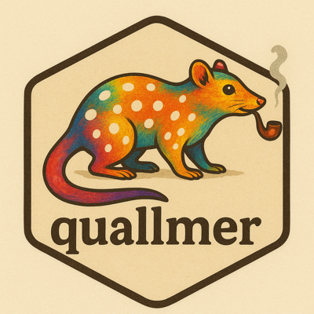

---
output:
  github_document:
    html_preview: false
---

<!-- README.md is generated from README.Rmd. Please edit that file -->

```{r, include = FALSE}
knitr::opts_chunk$set(
  collapse = TRUE,
  comment = "#>",
  fig.path = "man/figures/README-",
  out.width = "100%"
)
```

# quallmer <a href="https://quallmer.github.io/quallmer/"></a>

<!-- badges: start -->
[](https://CRAN.R-project.org/package=quallmer)
`r badger::badge_devel("quallmer/quallmer", "royalblue")`
[](https://github.com/quallmer/quallmer/actions/workflows/R-CMD-check.yaml)
[](https://app.codecov.io/gh/quallmer/quallmer)
[](https://quallmer.github.io/quallmer/)
[](https://lifecycle.r-lib.org/articles/stages.html#stable)
<!-- badges: end -->

The **quallmer** package is an **easy-to-use toolbox to quickly apply AI-assisted qualitative coding to large amounts of texts, images, pdfs, tabular data and other structured data.**

Using `qlm_code()`, users can apply codebook-based qualitative coding powered by large language models (LLMs) to generate structured, interpretable outputs. The package includes built-in codebooks for common applications and allows researchers to create custom codebooks tailored to their specific research questions using `qlm_codebook()`. To ensure quality and reliability of AI-generated coding, **quallmer** provides `qlm_compare()` for evaluating inter-rater reliability and `qlm_validate()` for assessing accuracy against gold standards. With `qlm_replicate()`, researchers can systematically compare results across different models and settings to assess sensitivity and reproducibility. The `qlm_trail()` function creates complete audit trails following Lincoln and Guba's (1985) concept for establishing trustworthiness in qualitative research.

**The quallmer package makes AI-assisted qualitative coding accessible without requiring deep expertise in R, programming or machine learning.**

## The quallmer workflow

### 1. Define codebook and prepare data

#### `qlm_codebook()`
- Creates custom codebooks tailored to specific research questions and data types.
- Uses `instructions` and type specifications from [ellmer](https://ellmer.tidyverse.org/reference/type_boolean.html) to define coding instructions and output structure.
- Example codebook objects (e.g., `data_codebook_sentiment`) demonstrate how to use built-in codebooks for common qualitative coding tasks.
- Extensible framework allows researchers to define domain-specific coding schemes.

### 2. Code data

#### `qlm_code()`
- Applies LLM-based coding to qualitative data using a `qlm_codebook`.
- Works with any LLM supported by [ellmer](https://ellmer.tidyverse.org/index.html).
- Returns a `qlm_coded` object containing the coded results and metadata for reproducibility.

#### `qlm_segment()` (optional)
- Segments texts into thematic or conceptual units using an LLM.
- Useful for aspect-based analysis, quasi-sentence segmentation, or splitting texts by topic.
- Returns a corpus of segmented units that can be coded with `qlm_code()` for more granular analysis (in the same pass or as a separate step).

### 3. Replicate with different settings

#### `qlm_replicate()`
- Re-executes coding with optional overrides (different models, codebooks, or parameters).
- Tracks provenance chain for comparing results across different configurations.
- Replays any backfill the original run had, so a replication is complete on the same terms.
- Enables systematic assessment of coding reliability and sensitivity to model choices.

### 4. Compare and validate results

#### `qlm_compare()`
- Compares multiple `qlm_coded` objects to assess inter-rater reliability.
- Computes agreement metrics including Krippendorff's alpha, Cohen's kappa, and Fleiss' kappa.  When comparing documents that have been segmented, automatically computes all four variants of Krippendorff's alpha for unitizing (2019, section 12.6) -- the only R package to do so.
- Useful for evaluating consistency across different coders, models, or coding runs.

#### `qlm_validate()`
- Validates LLM-coded output against gold standard human coding.
- Computes classification metrics: accuracy, precision, recall, F1-score, and Cohen's kappa.
- Supports multiple averaging methods (macro, micro, weighted) and per-class breakdowns.

### 5. Document audit trail

#### `qlm_trail()`
- Creates complete audit trails following Lincoln and Guba's (1985) concept for establishing trustworthiness.
- Captures the full decision history: models, parameters, timestamps, and parent-child relationships.
- Stores all coded results for confirmability and dependability.
- Reconstructs branching workflows when multiple coded objects are compared or validated.
- Generates replication materials: environment setup, API configuration, and executable R code.
- Use `qlm_trail(..., path = "filename")` to save RDS archive and Quarto report.

### Optional: complete an incomplete run

#### `qlm_backfill()`
- Completes a run: `qlm_failures()` lists the units a run failed on and why, and `qlm_backfill()` re-codes just those units and merges them back, so a few transient failures do not mean re-running the corpus.
- Uses the run's own model and settings by default; a different model can be given for units the original consistently refuses or cannot fit, and the result then records which units came from which model.
- `qlm_code(backfill = 2)` does this in the same call.

## Interactive quallmer app

For an interactive Shiny application to perform manual coding, review AI-generated annotations, and compute agreement metrics, see the companion package [quallmer.app](https://github.com/quallmer/quallmer.app).


## Supported LLMs

The package supports all LLMs currently available with the `ellmer`
package. For authentication and usage of each of these LLMs, please refer to the
respective [ellmer](https://ellmer.tidyverse.org/reference/index.html) documentation and see our [tutorial for setting up an OpenAI API key](https://quallmer.github.io/quallmer/articles/pkgdown/getting-started/openai.html) or [getting started with an open-source Ollama model](https://quallmer.github.io/quallmer/articles/pkgdown/getting-started/ollama.html).

## Installation

You can install the development version of **quallmer** from
<https://github.com/quallmer/quallmer> with:

```{r, eval = FALSE}
# install.packages("pak")
pak::pak("quallmer/quallmer")
```

## Example use and tutorials

To learn more about how to use the package, please refer to our [step-by-step tutorials](https://quallmer.github.io/quallmer/articles/getting-started.html).

## Acknowledgments

Development of this package was assisted by [Claude Code](https://claude.com/claude-code), an AI coding assistant by Anthropic, for code refactoring, documentation updates, and package restructuring. We also found OpenAI's [Codex](https://github.com/openai/codex) good for planning solutions to issues and for reviewing pull requests.

## References

Krippendorff, K. (2019). _Content Analysis: An Introduction to Its Methodology_ (4th ed.). Sage. doi:10.4135/9781071878781
