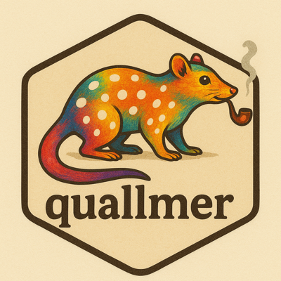

<!-- README.md is generated from README.Rmd. Please edit that file -->

# quallmer <a href="https://quallmer.github.io/quallmer/"></a>

<!-- badges: start -->

[](https://lifecycle.r-lib.org/articles/stages.html#experimental)
[](https://CRAN.R-project.org/package=quallmer)
[](https://github.com/SeraphineM/quallmer/actions/workflows/R-CMD-check.yaml)
[](https://app.codecov.io/gh/SeraphineM/quallmer)
[](https://quallmer.github.io/quallmer/)
<!-- badges: end -->

The **quallmer** package is an **easy-to-use toolbox to quickly apply
AI-assisted qualitative coding to large amounts of texts, images, pdfs,
tabular data and other structured data.**

Using `qlm_code()`, users can apply codebook-based qualitative coding
powered by large language models (LLMs) to generate structured,
interpretable outputs. The package includes built-in codebooks for
common applications and allows researchers to create custom codebooks
tailored to their specific research questions using `qlm_codebook()`. To
ensure quality and reliability of AI-generated coding, **quallmer**
provides `qlm_compare()` for evaluating inter-rater reliability and
`qlm_validate()` for assessing accuracy against gold standards. With
`qlm_replicate()`, researchers can systematically compare results across
different models and settings to assess sensitivity and reproducibility.
The quallmer trail system captures complete audit trails following
Lincoln and Guba’s (1985) concept for establishing trustworthiness in
qualitative research, using `qlm_trail()` and `qlm_archive()`.

**The quallmer package makes AI-assisted qualitative coding accessible
without requiring deep expertise in R, programming or machine
learning.**

## Coding and validation workflow

#### `qlm_codebook()`

- Creates custom codebooks tailored to specific research questions and
  data types.
- Uses `instructions` and type specifications from
  [ellmer](https://ellmer.tidyverse.org/reference/type_boolean.html) to
  define coding instructions and output structure.
- Example codebook objects (e.g., `data_codebook_sentiment`,
  `data_codebook_stance`, `data_codebook_ideology`) demonstrate how to
  use built-in codebooks for common qualitative coding tasks.
- Extensible framework allows researchers to define domain-specific
  coding schemes.

#### `qlm_code()`

- Applies LLM-based coding to qualitative data using a `qlm_codebook`.
- Works with any LLM supported by
  [ellmer](https://ellmer.tidyverse.org/index.html).
- Returns a `qlm_coded` object containing the coded results and metadata
  for reproducibility.

#### `qlm_compare()`

- Compares multiple `qlm_coded` objects to assess inter-rater
  reliability.
- Computes agreement metrics including Krippendorff’s alpha, Cohen’s
  kappa, and Fleiss’ kappa.
- Useful for evaluating consistency across different coders, models, or
  coding runs.

#### `qlm_validate()`

- Validates LLM-coded output against gold standard human coding.
- Computes classification metrics: accuracy, precision, recall,
  F1-score, and Cohen’s kappa.
- Supports multiple averaging methods (macro, micro, weighted) and
  per-class breakdowns.

## Replication

#### `qlm_replicate()`

- Re-executes coding with optional overrides (different models,
  codebooks, or parameters).
- Tracks provenance chain for comparing results across different
  configurations.
- Enables systematic assessment of coding reliability and sensitivity to
  model choices.

## Audit trail

#### `qlm_trail()`

- Creates complete audit trails following Lincoln and Guba’s (1985)
  concept for establishing trustworthiness.
- Captures the full decision history: models, parameters, timestamps,
  and parent-child relationships.
- Stores all coded results for confirmability and dependability.
- Reconstructs branching workflows when multiple coded objects are
  compared or validated.

#### `qlm_archive()`

- One-call convenience function to document your entire workflow.
- Creates RDS (complete archive), JSON (portable metadata), and Quarto
  reports.
- Works with coded objects directly or with a pre-built `qlm_trail`
  object.

## Interactive quallmer app

For an interactive Shiny application to perform manual coding, review
AI-generated annotations, and compute agreement metrics, see the
companion package
[quallmer.app](https://github.com/SeraphineM/quallmer.app).

## Supported LLMs

The package supports all LLMs currently available with the `ellmer`
package. For authentication and usage of each of these LLMs, please
refer to the respective
[ellmer](https://ellmer.tidyverse.org/reference/index.html)
documentation and see our [tutorial for setting up an OpenAI API
key](https://quallmer.github.io/quallmer/articles/pkgdown/tutorials/openai.html)
or [getting started with an open-source Ollama
model](https://quallmer.github.io/quallmer/articles/pkgdown/tutorials/ollama.html).

## Installation

You can install the development version of **quallmer** from
<https://github.com/SeraphineM/quallmer> with:

``` r
# install.packages("pak")
pak::pak("SeraphineM/quallmer")
```

## Example use and tutorials

To learn more about how to use the package, please refer to our
[step-by-step
tutorials](https://quallmer.github.io/quallmer/articles/getting-started.html).

## Acknowledgments

Development of this package was assisted by [Claude
Code](https://claude.com/claude-code), an AI coding assistant by
Anthropic, for code refactoring, documentation updates, and package
restructuring.
