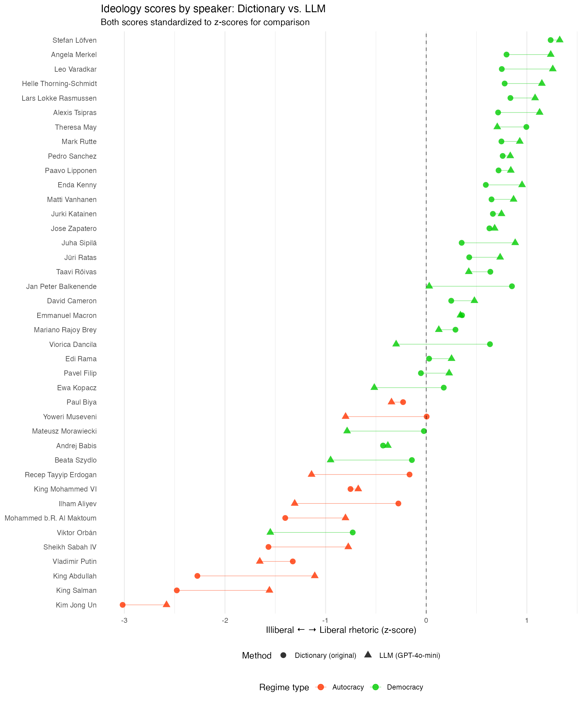
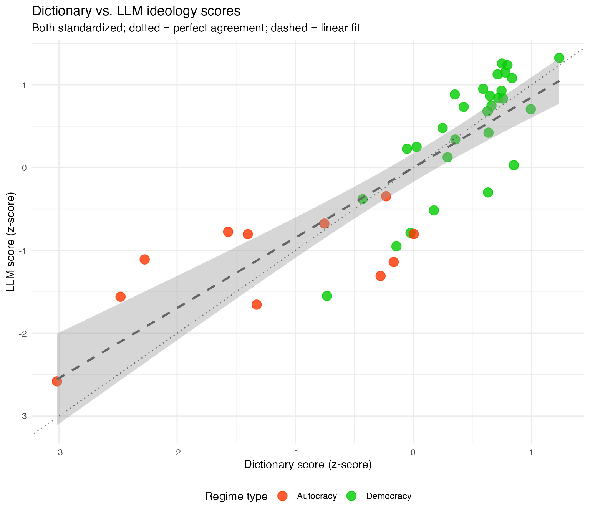

# Example: Illiberalism in political speeches

This example replicates the scaling of ideology, considering a range of
views consisting of liberalism and illiberalism, from [Maerz & Schneider
(2019)](https://doi.org/10.1007/s11135-019-00885-7). It uses LLM-based
coding with **quallmer** and compares the results to those in the
original article that used an index constructed on a dictionary
approach.

## The original study

Maerz and Schneider (2020) analyzed 4,740 speeches by 40 heads of
government from 27 countries to measure liberal vs. illiberal rhetoric.
The original study used a dictionary-based approach with 129 terms
associated with liberal rhetoric (e.g., *free-*, *liberal-*, *tolera-*)
or illiberal rhetoric (e.g., *anarch-*, *chaos*, *patriot-*).

The key finding was that language styles of political leaders correlate
with regime type, with autocratic leaders using more illiberal language.

## Loading packages and data

[`library`](https://rdrr.io/r/base/library.html)`(`[`quallmer`](https://quallmer.github.io/quallmer/)`)`` `[`library`](https://rdrr.io/r/base/library.html)`(`[`dplyr`](https://dplyr.tidyverse.org)`)`` `[`library`](https://rdrr.io/r/base/library.html)`(`[`ggplot2`](https://ggplot2.tidyverse.org)`)`

We first load the full corpus of 4,740 speeches (a 100-speech sample is
available in the package as `data_corpus_ms2020sample`):

`# Load full corpus from examples folder`` ``data_speeches_ms2020`` ``<-`` `[`readRDS`](https://rdrr.io/r/base/readRDS.html)`(``"data/data_speeches_ms2020.rds"``)`` `` ``# Full corpus`` `[`dim`](https://rdrr.io/r/base/dim.html)`(``data_speeches_ms2020``)`` ``#> [1] 4740 8`` `` ``# Speeches per speaker`` ``data_speeches_ms2020`` `[`%>%`](https://magrittr.tidyverse.org/reference/pipe.html)` `` `[`count`](https://dplyr.tidyverse.org/reference/count.html)`(``speaker``, ``regime``)`` `[`%>%`](https://magrittr.tidyverse.org/reference/pipe.html)` `` `[`arrange`](https://dplyr.tidyverse.org/reference/arrange.html)`(`[`desc`](https://dplyr.tidyverse.org/reference/desc.html)`(``n``)``)`` `[`%>%`](https://magrittr.tidyverse.org/reference/pipe.html)` `` `[`head`](https://rdrr.io/r/utils/head.html)`(``10``)`` ``#> speaker regime n`` ``#> 1 Vladimir Putin Autocracy 504`` ``#> 2 Viktor Orbán Democracy 425`` ``#> 3 Ilham Aliyev Autocracy 392`` ``#> 4 Edi Rama Democracy 340`` ``#> 5 Ewa Kopacz Democracy 307`` ``#> 6 Enda Kenny Democracy 271`` ``#> 7 Mariano Rajoy Brey Democracy 254`` ``#> 8 Beata Szydlo Democracy 230`` ``#> 9 Mateusz Morawiecki Democracy 223`` ``#> 10 Recep Tayyip Erdogan Autocracy 189`

## The codebook

We create a codebook that operationalizes the liberal-illiberal concept
from the original study:

`codebook_ideology`` ``<-`` `[`qlm_codebook`](https://quallmer.github.io/quallmer/reference/qlm_codebook.md)`(`` `` name ``=`` ``"Liberal-illiberal rhetoric"``,`` `` instructions ``=`` `[`paste`](https://rdrr.io/r/base/paste.html)`(`` `` ``"Analyze the rhetorical style of this political speech."``,`` `` ``""``,`` `` ``"ILLIBERAL rhetoric (negative scores) includes:"``,`` `` ``"- Nationalism and patriotic appeals"``,`` `` ``"- Paternalism and appeals to tradition"``,`` `` ``"- Emphasis on order, stability, and security"``,`` `` ``"- In-group/out-group distinctions"``,`` `` ``"- Rejection of pluralism"``,`` `` ``""``,`` `` ``"LIBERAL rhetoric (positive scores) includes:"``,`` `` ``"- Individual rights and freedoms"``,`` `` ``"- Tolerance and pluralism"``,`` `` ``"- Civil liberties and minority rights"``,`` `` ``"- Democratic values and rule of law"``,`` `` ``"- Open society principles"``,`` `` ``""``,`` `` ``"A score of 0 indicates neutral or mixed rhetoric."`` `` ``)``,`` `` schema ``=`` ``ellmer``::`[`type_object`](https://ellmer.tidyverse.org/reference/type_boolean.html)`(`` `` score ``=`` ``ellmer``::`[`type_integer`](https://ellmer.tidyverse.org/reference/type_boolean.html)`(`` `` description ``=`` ``"Rhetoric score from -10 (illiberal) to +10 (liberal)"`` `` ``)``,`` `` explanation ``=`` ``ellmer``::`[`type_string`](https://ellmer.tidyverse.org/reference/type_boolean.html)`(`` `` description ``=`` ``"Brief explanation of the assigned score"`` `` ``)`` `` ``)``,`` `` role ``=`` ``"You are an expert political scientist analyzing political rhetoric."``,`` `` input_type ``=`` ``"text"`` ``)`` `` ``codebook_ideology`` ``#> quallmer codebook: Liberal-illiberal rhetoric `` ``#> Input type: text`` ``#> Role: You are an expert political scientist analyzing political rh...`` ``#> Instructions: Analyze the rhetorical style of this political speech. ILLI...`` ``#> Output schema:ellmer::TypeObject`` ``#> Levels:`` ``#> score: ordinal`` ``#> explanation: nominal`

## Running the LLM analysis

We code all 4,740 speeches using GPT-4o-mini:

`coded_speeches`` ``<-`` `[`qlm_code`](https://quallmer.github.io/quallmer/reference/qlm_code.md)`(`` `` ``data_speeches_ms2020``$``text``,`` `` codebook ``=`` ``codebook_ideology``,`` `` model ``=`` ``"openai/gpt-4o-mini"``,`` `` name ``=`` ``"gpt4o_mini_ideology"``,`` `` notes ``=`` ``"LLM coding of 4,740 speeches for liberal-illiberal rhetoric"`` ``)`` `` ``# Save results`` `[`saveRDS`](https://rdrr.io/r/base/readRDS.html)`(``coded_speeches``, ``"data/coded_ideology_gpt4o.rds"``)`

Here’s a random sample of 10 coded speeches with metadata:

[`set.seed`](https://rdrr.io/r/base/Random.html)`(``42``)`` ``sample_ids`` ``<-`` `[`sample`](https://rdrr.io/r/base/sample.html)`(``data_speeches_ms2020``$``.id``, ``10``)`` `` ``data_speeches_ms2020`` `[`%>%`](https://magrittr.tidyverse.org/reference/pipe.html)` `` `[`filter`](https://dplyr.tidyverse.org/reference/filter.html)`(``.id`` `[`%in%`](https://rdrr.io/r/base/match.html)` ``sample_ids``)`` `[`%>%`](https://magrittr.tidyverse.org/reference/pipe.html)` `` `[`select`](https://dplyr.tidyverse.org/reference/select.html)`(``.id``, ``speaker``, ``country``, ``regime``)`` `[`%>%`](https://magrittr.tidyverse.org/reference/pipe.html)` `` `[`left_join`](https://dplyr.tidyverse.org/reference/mutate-joins.html)`(`` `` `[`as.data.frame`](https://rdrr.io/r/base/as.data.frame.html)`(``coded_speeches``)`` `[`%>%`](https://magrittr.tidyverse.org/reference/pipe.html)` `[`select`](https://dplyr.tidyverse.org/reference/select.html)`(``.id``, llm_score ``=`` ``score``, ``explanation``)``,`` `` by ``=`` ``".id"`` `` ``)`` `[`%>%`](https://magrittr.tidyverse.org/reference/pipe.html)` `` ``knitr``::`[`kable`](https://rdrr.io/pkg/knitr/man/kable.html)`(`` `` col.names ``=`` `[`c`](https://rdrr.io/r/base/c.html)`(``"ID"``, ``"Speaker"``, ``"Country"``, ``"Regime"``, ``"Score"``, ``"Explanation"``)``,`` `` caption ``=`` ``"Random sample of 10 coded speeches"`` `` ``)`

| ID | Speaker | Country | Regime | Score | Explanation |
|---:|:---|:---|:---|---:|:---|
| 356 | Leo Varadkar | Ireland | Democracy | 8 | The rhetoric in this speech emphasizes liberal values such as open trade, international cooperation, and a multicultural workforce. Varadkar advocates for individual rights and freedom while promoting economic opportunity and innovation. His references to democracy, civil liberties, and the importance of maintaining Ireland’s EU membership align closely with liberal ideology, indicating a strong commitment to pluralism and an open society. |
| 634 | Matti Vanhanen | Finland | Democracy | 7 | The speech emphasizes cooperation between the EU and Russia, highlighting shared values such as democracy, rule of law, and human rights. It advocates for mutual economic benefit and sustainable development, reflecting liberal principles of collaboration and pluralism. The focus on trade, investment, and energy cooperation signifies an openness to international relations and dialogue, which aligns with liberal rhetoric. However, it remains centered around economic interests rather than directly addressing individual rights or civil liberties, which contributes to a slightly lower score within the liberal range. |
| 1098 | Enda Kenny | Ireland | Democracy | 7 | The speech emphasizes sustainable economic growth, job creation, and partnerships within the EU, showcasing a liberal approach characterized by a focus on individual and collective progress, pluralism, and collaboration across borders. The speaker encourages cooperation and innovation while acknowledging social and economic challenges, which leans towards liberal values of civil liberties and democratic principles. |
| 1252 | Mariano Rajoy Brey | Spain | Democracy | 7 | The speech prominently features themes of cultural pride, pluralism, and the celebration of diversity through the cultural contributions of the Spanish language in an international context. The references to shared literary heritage between diverse cultures (Spanish and English) and the emphasis on cooperation and coexistence reflect liberal rhetoric ideals, fostering tolerance and mutual respect. It avoids narratives of nationalism or exclusion, instead advocating for cultural exchange and mutual understanding, thereby meriting a positive score. |
| 2097 | Edi Rama | Albania | Democracy | 5 | The speech predominantly emphasizes liberal principles such as improving tax administration, promoting individual enterprise, ensuring fairness in business practices, and collaboration with USAID to reform the system. It expresses a commitment to changing the mentality of tax inspectors and enhancing services for entrepreneurs, reflecting a pro-business stance. The references to improving civil administration and emphasizing a cooperation-based model indicate a focus on democratic values and rule of law, aligning it closer to liberal rhetoric. While there are elements of paternalism and a focus on national progress, the overall tone leans towards fostering open society principles and individual rights. |
| 2369 | Mateusz Morawiecki | Poland | Democracy | 0 | The rhetoric focuses on a specific economic policy change without invoking values related to nationalism, tradition, or societal divisions. It presents a neutral, factual statement regarding the reduction in taxes, which does not clearly align with either liberal or illiberal rhetoric. |
| 2609 | Beata Szydlo | Poland | Democracy | 5 | The rhetoric in this speech emphasizes collaboration, openness, and involvement of various stakeholders in addressing healthcare issues—aligning closely with liberal values of pluralism and democratic engagement. The speaker acknowledges the importance of residents and encourages their participation in decision-making processes, reflecting a commitment to individual rights and civil liberties. However, there are elements of state intervention and structured negotiations that could suggest a less completely liberal stance, hence the score of +5 rather than higher. |
| 3911 | King Mohammed VI | Morocco | Autocracy | -6 | The speech is characterized by strong nationalist sentiment, with repeated emphasis on territorial integrity and unity, as well as an in-group/out-group distinction regarding Moroccans and separatists. It promotes a paternalistic view of governance, advocating for development grounded in “true patriotism.” Although it mentions citizens’ rights and calls for transparency, the overarching tone is one of order, stability, and a rejection of perceived threats to national unity, illustrating illiberal tendencies. |
| 4069 | Vladimir Putin | Russia | Autocracy | -8 | The speech predominantly features illiberal rhetoric, emphasizing national security, military strength, and threats from international terrorism, reflecting a strong nationalist perspective. There are appeals to stability, order, and a paternalistic view of governance, with a clear distinction between ‘in-groups’ (the military and Russian citizens) and ‘out-groups’ (terrorists and foreign groups). The focus is on state security, military success, and a strong authoritarian leadership, which undermines individual rights and pluralism. |
| 4261 | Vladimir Putin | Russia | Autocracy | -5 | The speech exhibits several characteristics of illiberal rhetoric: a strong emphasis on national pride, traditional values, and a focus on collective achievements over individual rights. The speaker praises cultural and scientific contributions in a manner that underscores patriotism and stability, while framing individual accomplishments within the context of national interest. There are notable in-group distinctions made by celebrating ‘laureates’ who advance Russia’s defense and cultural heritage, promoting a narrative of unity and traditional values which aligns with illiberal themes. |

Random sample of 10 coded speeches {.table}

## Aggregating to speaker level

The original study aggregates speech-level dictionary counts to
speaker-level scores using a log-odds transformation (Lowe et al.,
2011):

``` math
\mu = \log\left(\frac{L + a}{I + a}\right)
```

where $`L`$ and $`I`$ are counts of liberal and illiberal dictionary
terms, and $`a = 0.5`$ is a Jeffreys prior. Since the LLM uses a -10 to
+10 scale, we standardize both to z-scores for comparison:

`# Combine coded results with metadata`` ``coded_with_meta`` ``<-`` ``data_speeches_ms2020`` `[`%>%`](https://magrittr.tidyverse.org/reference/pipe.html)` `` `[`select`](https://dplyr.tidyverse.org/reference/select.html)`(``.id``, ``speaker``, ``country``, ``regime``, dictionary_score ``=`` ``score``)`` `[`%>%`](https://magrittr.tidyverse.org/reference/pipe.html)` `` `[`left_join`](https://dplyr.tidyverse.org/reference/mutate-joins.html)`(`` `` `[`as.data.frame`](https://rdrr.io/r/base/as.data.frame.html)`(``coded_speeches``)`` `[`%>%`](https://magrittr.tidyverse.org/reference/pipe.html)` `[`select`](https://dplyr.tidyverse.org/reference/select.html)`(``.id``, llm_score ``=`` ``score``)``,`` `` by ``=`` ``".id"`` `` ``)`` `` ``# Aggregate to speaker level (mean score per speaker)`` ``speaker_scores`` ``<-`` ``coded_with_meta`` `[`%>%`](https://magrittr.tidyverse.org/reference/pipe.html)` `` `[`group_by`](https://dplyr.tidyverse.org/reference/group_by.html)`(``speaker``, ``country``, ``regime``)`` `[`%>%`](https://magrittr.tidyverse.org/reference/pipe.html)` `` `[`summarise`](https://dplyr.tidyverse.org/reference/summarise.html)`(`` `` n_speeches ``=`` `[`n`](https://dplyr.tidyverse.org/reference/context.html)`(``)``,`` `` dictionary_score ``=`` `[`mean`](https://rdrr.io/r/base/mean.html)`(``dictionary_score``)``,`` `` llm_score ``=`` `[`mean`](https://rdrr.io/r/base/mean.html)`(``llm_score``, na.rm ``=`` ``TRUE``)``,`` `` .groups ``=`` ``"drop"`` `` ``)`` `[`%>%`](https://magrittr.tidyverse.org/reference/pipe.html)` `` ``# Standardize both scores to z-scores for comparison`` `` `[`mutate`](https://dplyr.tidyverse.org/reference/mutate.html)`(`` `` dictionary_z ``=`` `[`scale`](https://rdrr.io/r/base/scale.html)`(``dictionary_score``)``[``,``1``]``,`` `` llm_z ``=`` `[`scale`](https://rdrr.io/r/base/scale.html)`(``llm_score``)``[``,``1``]`` `` ``)`` `[`%>%`](https://magrittr.tidyverse.org/reference/pipe.html)` `` `[`arrange`](https://dplyr.tidyverse.org/reference/arrange.html)`(``dictionary_score``)`` `` `[`head`](https://rdrr.io/r/utils/head.html)`(``speaker_scores``)`` ``#> ``# A tibble: 6 × 8`` ``#> speaker country regime n_speeches dictionary_score llm_score dictionary_z`` ``#> ``<chr>`` ``<chr>`` ``<chr>`` ``<int>`` ``<dbl>`` ``<dbl>`` ``<dbl>`` ``#> ``1`` Kim Jong Un North … Autoc… 24 -``2.44`` -``8.88`` -``3.02`` ``#> ``2`` King Salman Saudi … Autoc… 28 -``2.01`` -``4.57`` -``2.48`` ``#> ``3`` King Abdull… Saudi … Autoc… 34 -``1.85`` -``2.68`` -``2.27`` ``#> ``4`` Sheikh Saba… Kuwait Autoc… 128 -``1.29`` -``1.27`` -``1.57`` ``#> ``5`` Mohammed b.… UAE Autoc… 92 -``1.16`` -``1.39`` -``1.40`` ``#> ``6`` Vladimir Pu… Russia Autoc… 504 -``1.10`` -``4.97`` -``1.33`` ``#> ``# ℹ 1 more variable: llm_z <dbl>`

## Comparing dictionary and LLM approaches

We use
[`qlm_compare()`](https://quallmer.github.io/quallmer/reference/qlm_compare.md)
to assess inter-rater reliability between the two approaches at the
speaker level:

`# Create qlm_coded objects for comparison (using z-scores)`` ``dictionary_coded`` ``<-`` `[`as_qlm_coded`](https://quallmer.github.io/quallmer/reference/as_qlm_coded.md)`(`` `` ``speaker_scores`` `[`%>%`](https://magrittr.tidyverse.org/reference/pipe.html)` `[`select`](https://dplyr.tidyverse.org/reference/select.html)`(``.id ``=`` ``speaker``, score ``=`` ``dictionary_z``)``,`` `` name ``=`` ``"dictionary_ms2020"`` ``)`` `` ``llm_coded`` ``<-`` `[`as_qlm_coded`](https://quallmer.github.io/quallmer/reference/as_qlm_coded.md)`(`` `` ``speaker_scores`` `[`%>%`](https://magrittr.tidyverse.org/reference/pipe.html)` `[`select`](https://dplyr.tidyverse.org/reference/select.html)`(``.id ``=`` ``speaker``, score ``=`` ``llm_z``)``,`` `` name ``=`` ``"gpt4o_mini_aggregated"`` ``)`

`# Compare the two approaches`` ``# Set tolerance to 1 since the scales are different (z-scores) and we want to assess correlation rather than exact agreement (this affects the percent agreement metric)`` ``comparison`` ``<-`` `[`qlm_compare`](https://quallmer.github.io/quallmer/reference/qlm_compare.md)`(``dictionary_coded``, ``llm_coded``, by ``=`` ``"score"``, level ``=`` ``"interval"``, tolerance ``=`` ``1``)`` ``comparison`` ``#> `` ``#> ── ``Inter-rater reliability`` ──`` ``#> `` ``#> Subjects: 40`` ``#> Raters: 2`` ``#> `` ``#> ── score (interval)`` ``#> Percent agreement 0.9500 `` ``#> Krippendorff's alpha 0.8496 `` ``#> ICC 0.8509 `` ``#> Pearson's r 0.8477`` ``#> `

The comparison reveals a strong positive correlation between the
dictionary-based and LLM-based approaches. The Pearson’s *r* and ICC
values indicate that both methods capture similar underlying variation
in liberal-illiberal rhetoric across speakers. This suggests that
LLM-based coding can serve as a viable alternative to traditional
dictionary approaches, while offering additional benefits such as
contextual interpretation and explicit justifications for each score.

Importantly, perfect agreement is not expected: the dictionary approach
counts keyword occurrences, while the LLM evaluates rhetorical style
holistically. The observed correlation demonstrates convergent validity
— both methods measure related but not identical aspects of the
liberal-illiberal dimension.

## Replicating Figure 1

Figure 1 from the original paper shows each leader’s position on the
illiberal-liberal scale. We create a comparison showing both approaches
using standardized scores:

`# Prepare data for plotting (using z-scores for comparability)`` ``plot_data`` ``<-`` ``speaker_scores`` `[`%>%`](https://magrittr.tidyverse.org/reference/pipe.html)` `` ``tidyr``::`[`pivot_longer`](https://tidyr.tidyverse.org/reference/pivot_longer.html)`(`` `` cols ``=`` `[`c`](https://rdrr.io/r/base/c.html)`(``dictionary_z``, ``llm_z``)``,`` `` names_to ``=`` ``"method"``,`` `` values_to ``=`` ``"score"`` `` ``)`` `[`%>%`](https://magrittr.tidyverse.org/reference/pipe.html)` `` `[`mutate`](https://dplyr.tidyverse.org/reference/mutate.html)`(`` `` method ``=`` `[`case_when`](https://dplyr.tidyverse.org/reference/case-and-replace-when.html)`(`` `` ``method`` ``==`` ``"dictionary_z"`` ``~`` ``"Dictionary (original)"``,`` `` ``method`` ``==`` ``"llm_z"`` ``~`` ``"LLM (GPT-4o-mini)"`` `` ``)`` `` ``)`` `` ``# Create comparison plot`` `[`ggplot`](https://ggplot2.tidyverse.org/reference/ggplot.html)`(``plot_data``, `[`aes`](https://ggplot2.tidyverse.org/reference/aes.html)`(``x ``=`` `[`reorder`](https://rdrr.io/r/stats/reorder.factor.html)`(``speaker``, ``score``)``, y ``=`` ``score``,`` `` color ``=`` ``regime``, shape ``=`` ``method``)``)`` ``+`` `` `[`geom_line`](https://ggplot2.tidyverse.org/reference/geom_path.html)`(`[`aes`](https://ggplot2.tidyverse.org/reference/aes.html)`(``group ``=`` ``speaker``)``, linewidth ``=`` ``0.3``, alpha ``=`` ``0.5``)`` ``+`` `` `[`geom_point`](https://ggplot2.tidyverse.org/reference/geom_point.html)`(``size ``=`` ``3``, alpha ``=`` ``0.8``)`` ``+`` `` `[`geom_hline`](https://ggplot2.tidyverse.org/reference/geom_abline.html)`(``yintercept ``=`` ``0``, linetype ``=`` ``"dashed"``, alpha ``=`` ``0.5``)`` ``+`` `` `[`scale_color_manual`](https://ggplot2.tidyverse.org/reference/scale_manual.html)`(`` `` name ``=`` ``"Regime type"``,`` `` values ``=`` `[`c`](https://rdrr.io/r/base/c.html)`(``"Autocracy"`` ``=`` ``"#FF3300"``, ``"Democracy"`` ``=`` ``"#00CC00"``)`` `` ``)`` ``+`` `` `[`scale_shape_manual`](https://ggplot2.tidyverse.org/reference/scale_manual.html)`(`` `` name ``=`` ``"Method"``,`` `` values ``=`` `[`c`](https://rdrr.io/r/base/c.html)`(``"Dictionary (original)"`` ``=`` ``16``, ``"LLM (GPT-4o-mini)"`` ``=`` ``17``)`` `` ``)`` ``+`` `` `[`labs`](https://ggplot2.tidyverse.org/reference/labs.html)`(`` `` x ``=`` ``NULL``,`` `` y ``=`` ``"Illiberal ← → Liberal rhetoric (z-score)"``,`` `` title ``=`` ``"Ideology scores by speaker: Dictionary vs. LLM"``,`` `` subtitle ``=`` ``"Both scores standardized to z-scores for comparison"`` `` ``)`` ``+`` `` `[`coord_flip`](https://ggplot2.tidyverse.org/reference/coord_flip.html)`(``)`` ``+`` `` `[`theme_minimal`](https://ggplot2.tidyverse.org/reference/ggtheme.html)`(``)`` ``+`` `` `[`theme`](https://ggplot2.tidyverse.org/reference/theme.html)`(`` `` legend.position ``=`` ``"bottom"``,`` `` legend.box ``=`` ``"vertical"``,`` `` panel.grid.major.y ``=`` `[`element_blank`](https://ggplot2.tidyverse.org/reference/element.html)`(``)`` `` ``)`



*Note:* Regime classifications are based on V-Dem’s `v2x_regime`
variable and correspond to the years mostly covered by the speeches for
each speaker. For more details, see the [original
paper](https://doi.org/10.1007/s11135-019-00885-7).

## Scatter plot: Dictionary vs. LLM scores

A direct comparison of the two scoring methods using standardized
scores:

[`ggplot`](https://ggplot2.tidyverse.org/reference/ggplot.html)`(``speaker_scores``, `[`aes`](https://ggplot2.tidyverse.org/reference/aes.html)`(``x ``=`` ``dictionary_z``, y ``=`` ``llm_z``, color ``=`` ``regime``)``)`` ``+`` `` `[`geom_point`](https://ggplot2.tidyverse.org/reference/geom_point.html)`(``size ``=`` ``4``, alpha ``=`` ``0.8``)`` ``+`` `` `[`geom_smooth`](https://ggplot2.tidyverse.org/reference/geom_smooth.html)`(``method ``=`` ``"lm"``, se ``=`` ``TRUE``, color ``=`` ``"gray40"``, linetype ``=`` ``"dashed"``)`` ``+`` `` `[`geom_abline`](https://ggplot2.tidyverse.org/reference/geom_abline.html)`(``slope ``=`` ``1``, intercept ``=`` ``0``, linetype ``=`` ``"dotted"``, alpha ``=`` ``0.5``)`` ``+`` `` `[`scale_color_manual`](https://ggplot2.tidyverse.org/reference/scale_manual.html)`(`` `` name ``=`` ``"Regime type"``,`` `` values ``=`` `[`c`](https://rdrr.io/r/base/c.html)`(``"Autocracy"`` ``=`` ``"#FF3300"``, ``"Democracy"`` ``=`` ``"#00CC00"``)`` `` ``)`` ``+`` `` `[`labs`](https://ggplot2.tidyverse.org/reference/labs.html)`(`` `` x ``=`` ``"Dictionary score (z-score)"``,`` `` y ``=`` ``"LLM score (z-score)"``,`` `` title ``=`` ``"Dictionary vs. LLM ideology scores"``,`` `` subtitle ``=`` ``"Both standardized; dotted = perfect agreement; dashed = linear fit"`` `` ``)`` ``+`` `` `[`theme_minimal`](https://ggplot2.tidyverse.org/reference/ggtheme.html)`(``)`` ``+`` `` `[`theme`](https://ggplot2.tidyverse.org/reference/theme.html)`(``legend.position ``=`` ``"bottom"``)`` ``` #> `geom_smooth()` using formula = 'y ~ x' ``



The scatter plot shows the relationship between the two scoring methods
at the speaker level. Points close to the dotted diagonal line indicate
strong agreement between methods. The color separation confirms the
original study’s finding: autocratic leaders (red) cluster toward the
illiberal end, while democratic leaders (green) tend toward more liberal
rhetoric.

The linear fit (dashed line) closely follows the diagonal, indicating
that the methods not only correlate but also produce comparable scales
after z-score standardization. Deviations from the diagonal highlight
cases where the LLM’s contextual interpretation differs from the
dictionary’s keyword-based assessment — these cases may warrant
qualitative inspection of the LLM’s explanations to understand the
discrepancy.

## Creating the audit trail

Document the complete analysis:

[`qlm_trail`](https://quallmer.github.io/quallmer/reference/qlm_trail.md)`(``coded_speeches``, path ``=`` ``"ideology_replication"``)`

This creates two files:

- `ideology_replication.rds`: Complete trail object containing all
  coding runs, codebooks, and metadata (reloadable with
  [`readRDS()`](https://rdrr.io/r/base/readRDS.html))
- `ideology_replication.qmd`: Quarto document with full audit trail
  documentation following Lincoln and Guba’s (1985) framework, including
  instrument development, process notes, and replication code

## Conclusion

This replication demonstrates:

1.  **Comparable results**: The LLM approach produces scores that
    correlate with the original dictionary method
2.  **Context sensitivity**: LLMs can capture rhetorical nuances that
    keyword-based dictionaries miss
3.  **Justifications**: LLMs provide explanations for their scores,
    enhancing interpretability and transparency.
4.  **Transparency**: The original dictionary approach remains valuable
    for its transparency and reproducibility. The LLM coding is
    documented with an audit trail, ensuring that the process is
    transparent and traceable.

## References

Maerz, S. F., & Schneider, C. Q. (2020). Comparing public communication
in democracies and autocracies: Automated text analyses of speeches by
heads of government. *Quality & Quantity*, 54, 517–545.
<https://doi.org/10.1007/s11135-019-00885-7>
