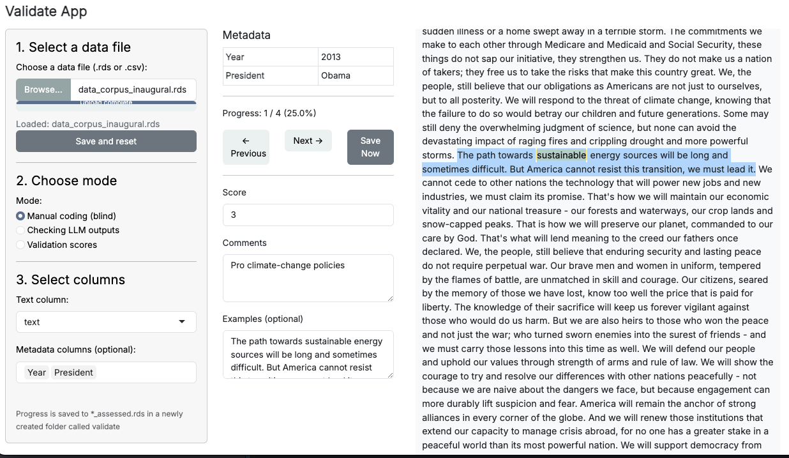
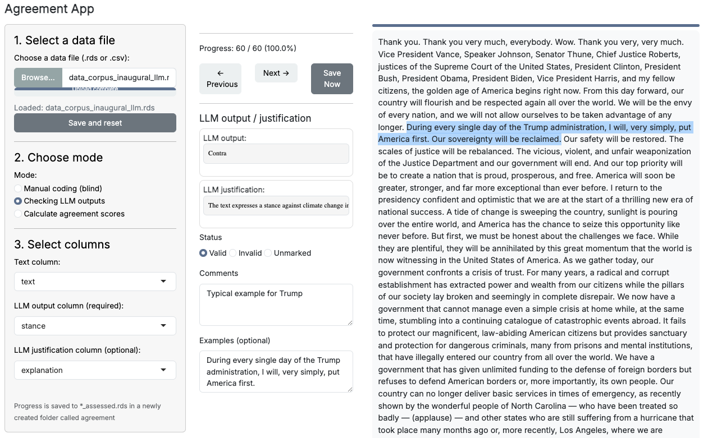
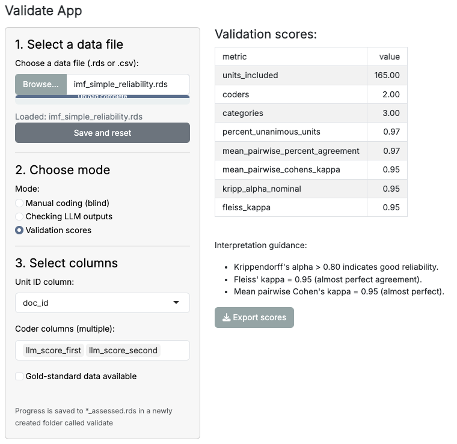

The quallmer app is a user-friendly interface that allows researchers to manually code data, review LLM-generated annotations, and calculate inter-rater reliability scores such as Krippendorff's alpha and Fleiss' kappa or compare LLM-annotations against a gold standard for accuracy scores. This tutorial will guide you through the steps of using the quallmer app effectively. If you prefer to work programmatically, the quallmer package also provides functions to perform these tasks without the app, which are described in [other tutorials](https://seraphinem.github.io/quallmer/articles/pkgdown/tutorials/compare.html).

## Installation

The quallmer app is available in the companion package `quallmer.app`. To install it:

```r
# install.packages("pak")
pak::pak("SeraphineM/quallmer.app")
```

## Launching the quallmer app
To launch the quallmer app, load the `quallmer.app` package and call the `validate_app()` function. This will open the quallmer app in a new window or tab in your web browser.

```r
library(quallmer.app)
validate_app()
```

## Using the quallmer app for manual coding

Once the quallmer app is launched, you can start by uploading your dataset. The app supports .csv or .rds file formats. After uploading your data, you can select the column containing the content (e.g., texts, images, etc.) you want to manually assess. While using the app, you can manually assign a score or comments to each text item based on your coding scheme. You can also save example sentences from each text item to help you remember your coding decisions later or as illustrative examples for your research. 



## Reviewing LLM-generated annotations

If you have previously used the `quallmer` package to generate annotations using large language models (LLMs), you can upload those annotations into the quallmer app for review. The app allows you to check the LLM-generated codes alongside justifications provided by the model. You can then decide whether to accept these annotations as `valid` or `invalid`, or modify them based on your assessment by adding comments and example sentences.




## Saving your coding decisions

The app provides an intuitive interface for navigating through the data and making coding decisions. **All your coding decisions will be saved automatically, you find it in a newly created folder named "agreement" in your working directory.**


## Calculating validation scores

After completing the manual coding and reviewing the LLM-generated annotations, the quallmer app provides functionality to calculate inter-rater reliability scores or compare LLM annotations against a gold standard. You can choose from various metrics, such as Krippendorff's alpha, Cohen's or Fleiss' kappa, to assess the agreement between different coders or between your manual codes and the LLM annotations or, as shown below, between multiple LLM runs. The app also provides some interpretation guidelines to help you understand the results. If you have a gold standard available, the app will calculate accuracy metrics such as precision, recall, and F1-score.

### Example of inter-rater reliability scores (no gold standard available)

{width=70%}

### Example of accuracy assessment against a gold standard

{width=70%}

In summary, the quallmer app provides a convenient and user-friendly way to manually code data, review LLM-generated annotations, and calculate inter-rater reliability or accuracy scores. By following the steps outlined in this tutorial, you can effectively utilize the quallmer app for your qualitative research projects.
